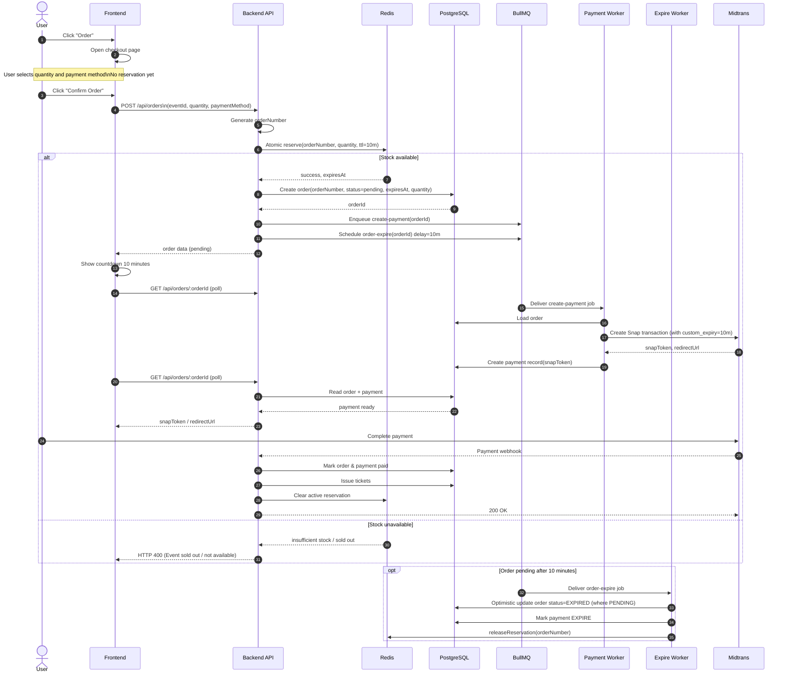

# Order Reservation Sequence Diagram

This document captures the attendee checkout flow with:

- checkout page before stock reservation
- Redis reservation created only after order confirmation
- synchronous order creation
- asynchronous payment initialization
- Midtrans webhook for final payment confirmation

## Main Flow

## Behavioral Notes

- Reservation starts only after the attendee clicks `Confirm Order`.
- Opening the checkout page does not hold stock.
- The API must return `orderId` immediately after the order row is created.
- The frontend should continue the same pending order if the attendee returns before expiry.
- Reservation TTL is 10 minutes.
- Quantity must be part of the atomic reservation request.
