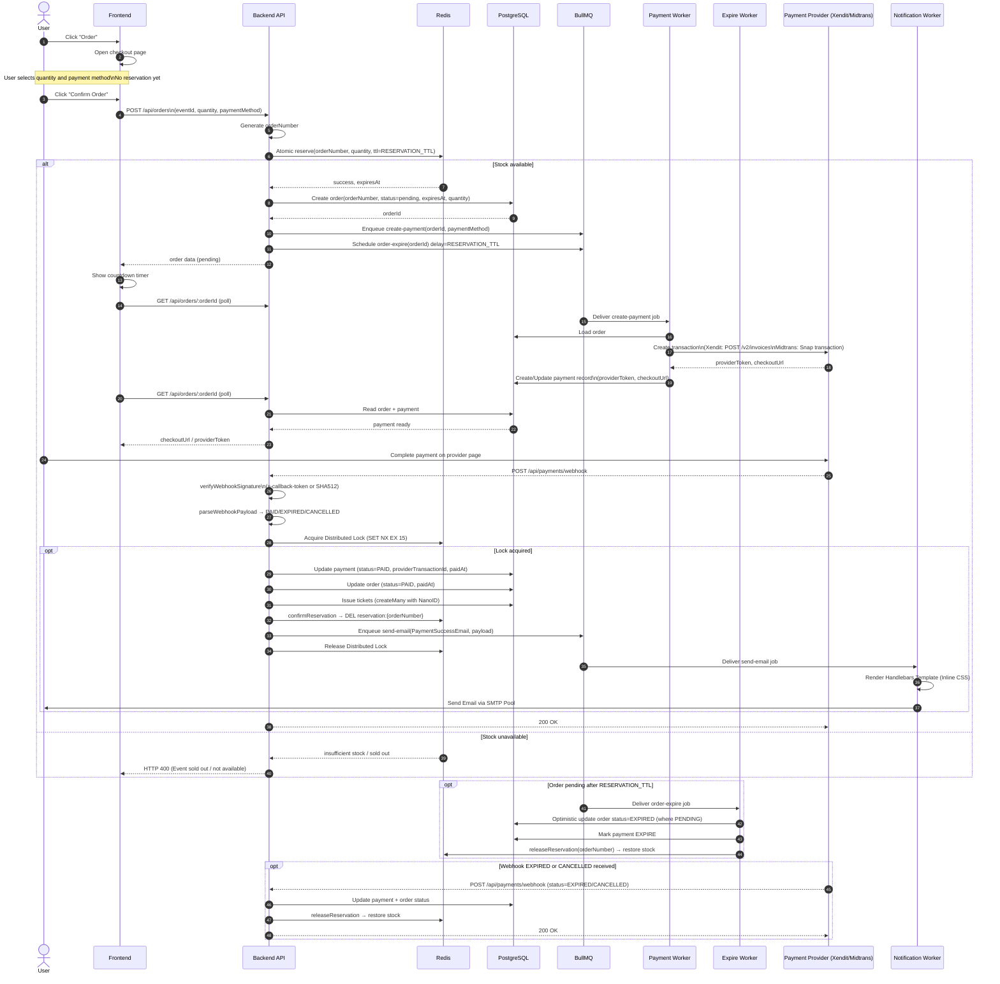

# Order Reservation Sequence Diagram

This document captures the attendee checkout flow with:

- checkout page before stock reservation
- Redis reservation created only after order confirmation
- synchronous order creation
- asynchronous payment initialization
- Xendit/Midtrans webhook for final payment confirmation

## Main Flow

## Behavioral Notes

- Reservation starts only after the attendee clicks `Confirm Order`.
- Opening the checkout page does not hold stock.
- The API must return `orderId` immediately after the order row is created.
- The frontend should continue the same pending order if the attendee returns before expiry.
- Reservation TTL is configurable via `RESERVATION_TTL` env var (default: 5 minutes).
- Quantity must be part of the atomic reservation request.
- Webhook endpoint `POST /api/payments/webhook` is public (no auth middleware).
- Idempotency: 
  - Uses **Redis Distributed Lock** (`SET NX EX 15`) to prevent race conditions from concurrent duplicate webhooks.
  - Webhook is ignored if order is already in a terminal state (`paid`, `expired`, `cancelled`).
- Provider signature is verified before any DB operation:
  - **Xendit**: `x-callback-token` header compared against `XENDIT_WEBHOOK_TOKEN`
  - **Midtrans**: SHA512(`order_id + status_code + gross_amount + server_key`) from body
- Tickets use **NanoID** (10-chars, unambiguous alphabet) to eliminate DB `UniqueConstraint` collisions.

## Payment Provider Strategy

Active provider is selected via `PAYMENT_GATEWAY_PROVIDER` env var (default: `xendit`).

| Feature | Xendit | Midtrans |
| --- | --- | --- |
| Transaction endpoint | `POST /v2/invoices` | Snap `POST /snap/v1/transactions` |
| Checkout URL | `invoice_url` | `redirect_url` |
| Provider token | Invoice `id` | Snap `token` |
| Provider transaction ID (webhook) | `payment_id` | `transaction_id` |
| Webhook auth | `x-callback-token` header | SHA512 signature in body |
